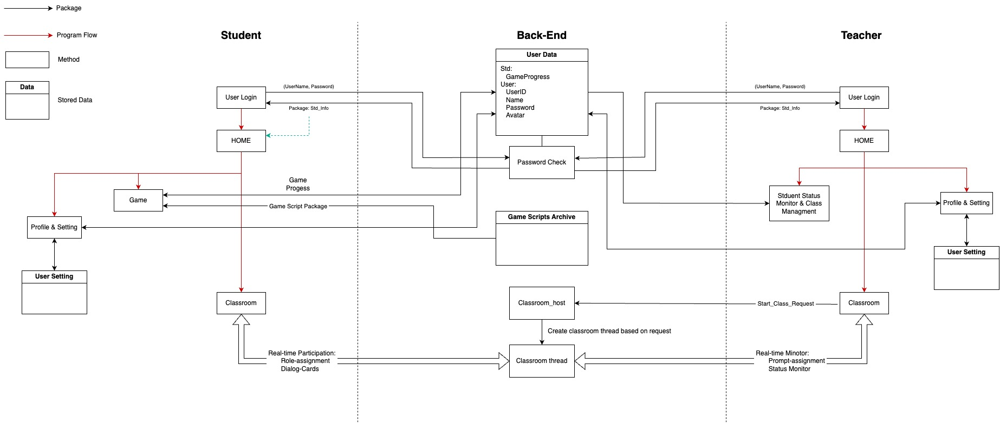

# Implementation Note:

## Front-end:

Front-end part of our project. We chose to use Flutter due to its advantages in cross-platform development.

The coding workspace for front-end development is under **"front_end"** folder. 

**To get started, you can:**

  1. Clone this entire repository to your device using [GitHub Desktop](https://github.com/apps/desktop).
  2. Open your IDE and choose "_Development/front_end/flutter_project_" as your project directory and _open project_.
  3. Your IDE will ~~hopefully~~ automatically know that GitHub is managing version control of this folder so you don't have to setup version control manually.

### About Flutter:

[Flutter](https://flutter.dev/) is the cross-platform development tool that we're using. Flutter itself is just an open-source [**SDK**](https://www.adjust.com/glossary/sdk/) developed by Google. To write your code, you will need an [**IDE**](https://www.codecademy.com/article/what-is-an-ide) like [_VSCode_](https://code.visualstudio.com/) or [_IntelliJ_](https://www.jetbrains.com/idea/). 

How do you develop with Flutter in IDE that is not designed for it? Well, check out the following links. You'll get an answer while you install Flutter.

BTW: The language Flutter uses is called **Dart**. 

[Install Flutter for MacOs](https://docs.flutter.dev/get-started/install/macos/desktop)

[Install Flutter for Windows](https://docs.flutter.dev/get-started/install/windows/desktop)

[How to write your first Flutter app](https://docs.flutter.dev/get-started/codelab)

:point_up_2: Please find an introduction to the features of Flutter here. It has basically everything you'll need: UI & More
